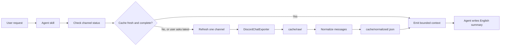
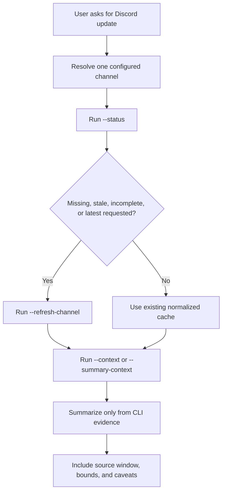

# Discord Summary Helper

Local Discord evidence-preparation CLI for agent summaries. It exports one configured channel at a time, caches raw and normalized data, reports cache status, and emits bounded LLM-ready context for Codex, Claude Code, or another agent to summarize.

The CLI is config-first. Normal skill use should not pass policy flags such as `--since-days`, `--after`, `--compact`, `--max-messages`, `--max-chars`, or `--timeout-seconds`; those are one-off manual overrides only.

This tool does not provide a hosted service, Discord credentials, Discord scraping logic, or built-in LLM summarization for the normal workflow. The CLI prepares evidence; the agent writes the final summary.

## Why This Exists

Discord channels are useful but noisy. A good agent summary needs bounded evidence, clear source windows, cache freshness, and caveats. This tool handles that preparation layer so the agent can focus on reasoning over the exported evidence instead of guessing what was fetched.

What it gives you:

- one-channel refreshes instead of accidental server-wide exports
- explicit cache status before summarization
- normalized local JSON output from DiscordChatExporter exports
- compact context with message timestamps, authors, post/thread grouping, links, attachments, and bounds
- a ready-to-copy agent skill for repeatable summaries

## How It Works



The important boundary is that Discord Summary Helper prepares local evidence. It does not decide what is true beyond the exported data, and it does not need to call an LLM.

## Quickstart

```bash
pip install -e .
copy config.example.json config.json
copy .env.example .env
python discord_cli.py --validate-config
discord-summary --status performance
discord-summary --context performance
```

Then give the generated context to an agent, or install the included skill and ask for a channel summary in natural language.

## Project Layout

```text
discord-summary-helper/
  README.md
  LICENSE
  .gitignore
  .env.example
  config.example.json
  pyproject.toml
  discord_cli.py
  test_discord_cli.py
  SKILL.md
  skills/
    discord-summary-helper/
      SKILL.md
  state/
    channel_status.example.json
    last_runs.example.json
```

Local runtime files are intentionally ignored:

```text
config.json
.env
cache/
state/*.json
DiscordChatExporter.Cli*/
.local/
```

## Discord Exporter Dependency

This project does not implement Discord message export itself.

It relies on DiscordChatExporter, which must be downloaded and configured separately by the user.

Users should:

1. Download DiscordChatExporter from the official project: [tyrrrz/discordchatexporter](https://github.com/tyrrrz/discordchatexporter).
2. Follow the installation instructions from that project.
3. Configure the local exporter path in `config.json`.
4. Provide their own Discord authentication/token according to the exporter documentation.
5. Verify that local setup works before using Discord Summary Helper.

This repository does not bundle DiscordChatExporter binaries.

## Setup

1. Install Python 3.12 or newer.
2. Preferred optional install path:

```bash
pip install -e .
```

After editable install, `discord-summary --status performance` is equivalent to `python discord_cli.py --status performance`. You can also skip installation and run commands directly with `python discord_cli.py ...`.

3. Download DiscordChatExporter CLI and place it under `DiscordChatExporter.Cli.win-x64/`, or update `discord_exporter_path` in `config.json`.
4. Create local config:

```bash
copy config.example.json config.json
```

Edit `config.json` for your server before running exports: set `server_id`, each channel `id`, `discord_exporter_path`, and `env_path`.

5. Create `.env`:

```text
discord_token_key=YOUR_DISCORD_TOKEN
```

If you change `token_env_var` in `config.json`, use the same variable name in `.env`.

6. Validate local setup:

```bash
python discord_cli.py --validate-config
```

Local files such as `config.json`, `.env`, `cache/`, `state/*.json`, and the exporter binary are ignored by Git.

## Config Checklist

Before exporting, edit these fields in `config.json`:

- `server_id`
- each configured channel `id`
- `discord_exporter_path`
- `env_path`
- `token_env_var`, only if you renamed the token variable in `.env`

Minimal channel shape:

```json
{
  "name": "04-performance-engineering",
  "id": "DISCORD_CHANNEL_ID_HERE",
  "aliases": ["performance", "performance engineering", "perf"],
  "type": "forum",
  "enabled": true
}
```

## Normal Skill Workflow

Use this flow for one channel only:



```bash
python discord_cli.py --status 04-performance-engineering
python discord_cli.py --refresh-channel 04-performance-engineering
python discord_cli.py --context 04-performance-engineering
```

Only refresh when status is `missing`, `stale`, `incomplete`, or when the user explicitly asks for latest/current updates.

Natural-language routing is also supported:

```bash
python discord_cli.py --summary-context "Summarize the latest updates from performance engineering"
```

## Agent Skill

The repository includes the same skill in two places:

```text
SKILL.md
skills/discord-summary-helper/SKILL.md
```

Copy `skills/discord-summary-helper/` into your agent's skill directory, or keep the root `SKILL.md` open as the operating instructions.

The skill tells the agent to:

1. Resolve the request to one configured channel.
2. Run status first.
3. Refresh only if cache is missing, stale, incomplete, or the user asks for latest/current updates.
4. Run `--context` or `--summary-context`.
5. Summarize only from the emitted evidence.
6. Include the source window, evidence bounds, and caveats.

## Core Commands

| Command | Purpose |
|---|---|
| `python discord_cli.py --list-channels` | Show configured channels and aliases. |
| `python discord_cli.py --status` | Show cache status for all configured channels. |
| `python discord_cli.py --status <channel>` | Show cache status and effective config for one channel. |
| `python discord_cli.py --refresh-channel <channel>` | Refresh exactly one configured channel. |
| `python discord_cli.py --refresh-missing` | Refresh only configured channels with missing normalized cache. |
| `python discord_cli.py --refresh-stale` | Refresh only configured channels with stale cache. |
| `python discord_cli.py --context <channel>` | Emit bounded context for one known channel. |
| `python discord_cli.py --summary-context "<request>"` | Resolve a natural-language request and emit context. |

`--bootstrap-server` exists for explicit first-time/broad refreshes only. Do not use it during normal summaries.

If installed with `pip install -e .`, replace `python discord_cli.py` with `discord-summary`.

## Example Output

Status output is designed for both humans and agents:

```text
channel: 04-performance-engineering
effective config:
resolved channel: 04-performance-engineering
resolved context window: after=2026-06-19, since_days=1
max_messages: 50
max_chars: 30000
compact mode: True
cache freshness: ok
message count: 12
partial export: False
recommended action: Use existing normalized cache
```

Context output includes grouped evidence and instructions:

```text
resolved channel: 04-performance-engineering
source: normalized cache
context mode: compact
time range: after=2026-06-19T00:00:00+03:00, before=open
messages available: 12
snippets included: 12

grouped compact context:
- post: 04 | Inference - From Roofline to CUDA Graphs
  snippet 1: [timestamp] Author: message text...

agent summary instructions:
- Answer in English.
- Use only the Discord evidence in this context.
- Include the source window and caveats.
```

## Config Model

Global defaults live in `tool_defaults`. Per-channel exceptions live in `channels[].overrides`.

Important fields:

- `default_context_window`: what time window context should cover.
- `refresh_window`: what time window the exporter downloads.
- `stale_threshold_hours`: when cache becomes stale.
- `max_messages` / `max_chars`: evidence bounds for context output.
- `include_threads`: defaults to `Active` for forum channels and `None` for text channels.

For current non-merge behavior, keep `refresh_window` at least as wide as `default_context_window` for a channel. The CLI warns with `status: incomplete` when cached data does not cover the requested context window.

## Summary Expectations

The CLI does not need to call an LLM. It emits evidence and instructions. The agent should summarize in English with:

- practical main points, not only topic labels
- per-post/thread explanations for forum channels
- decisions and action items
- open questions
- source window and caveats

To package the skill for an agent, use either the root `SKILL.md` or copy `skills/discord-summary-helper/SKILL.md` into the agent's skills directory.

## Known Limitations

- `--summary-context` may not parse every natural-language time expression yet, for example "last 2 hours".
- For explicit unsupported time windows, users or agents can use one-off overrides such as `--after`.
- `--summarize` is not required for the normal skill workflow.
- The tool relies on DiscordChatExporter and local user credentials.
- The tool does not host, collect, or store data outside the local filesystem.

## Disclaimer

This project is an evidence-preparation and summarization helper.

It is not affiliated with Discord or the DiscordChatExporter project.

Users are solely responsible for:

- obtaining and managing their own Discord credentials
- complying with Discord's Terms of Service
- complying with local laws, regulations, and organizational policies
- ensuring they have permission to access and process exported data

The author(s) of this repository:

- do not provide Discord credentials
- do not collect user data
- do not operate any hosted service
- do not assume responsibility for misuse of Discord accounts, exported data, or third-party tools

Use this software at your own risk.

## Security Notes

Never commit:

- Discord tokens
- `.env`
- exported Discord data
- cache files
- runtime state files

Always review `.gitignore` before publishing changes.

## Safety

- Normal refreshes use `export -c <channel_id>`, not `exportguild`.
- Timeout errors are handled without printing tokens.
- Failed refreshes write to a partial raw directory and do not overwrite the previous good raw cache.
- `--verbose` may print exporter commands, but tokens are redacted.

## Verification

Run before publishing or after changes:

```bash
python -m unittest test_discord_cli.py
python -m py_compile discord_cli.py test_discord_cli.py
python discord_cli.py --validate-config
```
